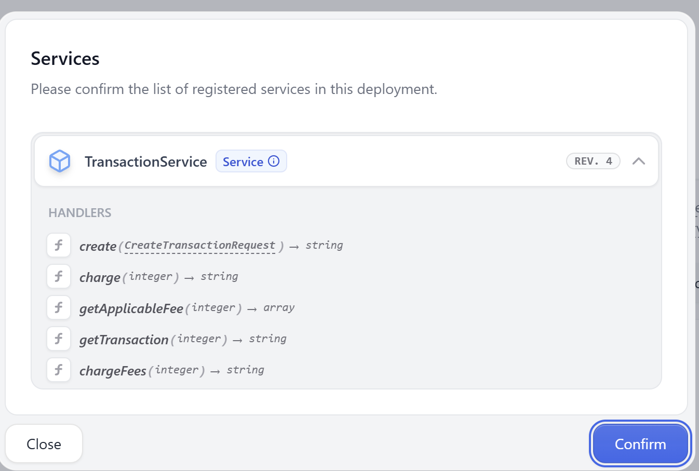

# Transaction Service

---

## Service Overview

The Transaction Service is responsible for handling the complete lifecycle of transactions and their associated domain entities:

- **Transactions**: Creation, management, and tracking of transaction records.
- **Fees**: Calculation and association of fees with transactions.
- **Fee Types**: Definition and management of various fee categories.

## Getting Started

### Running the Application Locally

1. **Clone the Repository**  
   Download the project from GitHub and extract the ZIP file.

2. **Navigate to the Project Directory**  
   Change to the `ctc` directory:

   ```sh
   cd ctc
   ```

3. **Start the Service**  
   Use `make up` to launch the application:

   ```sh
   make up
   ```

   

4. **Access the API Documentation**  
   Open [http://localhost:8080/openapi](http://localhost:8080/openapi) in your browser to view and test the APIs using Swagger.
   

5. Use `./gradlew test` to run test
   ```sh
   ./gradlew test
   ```
   

## Specifications

### Technology Stack

- **Language**: Kotlin
- **Framework**: Ktor
- **Dependency Injection**: Koin
- **Persistence**: JPA (Hibernate)
- **Database**: PostgreSQL
- **API Documentation**: OpenAPI (Swagger UI)
- **Build Tool**: Gradle
- **Containerization**: Docker, Docker Compose
- **Testing**: JUnit, Kotest
- **Logging**: Logback
- **Configuration**: YAML

## Architecture

The project follows hexagonal architecture. The domain contains the business logic which is completely isolated from the infrastructure. The controller accesses the domain through the application programming interfaces (APIs) while the resources needed by the domain is being injected by the providers by implementing the service provider interfaces (SPIs).


## Moving forward

- More unit and integration tests
- Exception and error handling
- Identity management (authentication and authorization)
- Its good practice to have metrics, tracing and logging for observability
- Instead of docker, databases are advised to be hosted in a fully managed database-as-a-service solutions like AWS RDS
- Error monitoring like sentry would help in issue discovery and resolution

## Restate Implementation 🚀

An alternative implementation using [Restate](https://restate.dev/) is available in the `restate-implementation` git branch.

### Steps to Run the Restate Implementation

1. **Clone the Repository**  
   Download or clone the project from GitHub.

2. **Navigate to the Project Directory**

   ```sh
   cd ctc
   ```

3. **Switch to the Restate Branch**

   ```sh
   git checkout restate-implementation
   ```

4. **Start the Application**  
   Build and run the service:

   ```sh
   ./gradlew clean build run
   ```

5. **Start the Restate Server**  
   Launch the Restate development server using Docker:

   ```sh
   docker run --name restate_dev --rm \
     -p 8080:8080 -p 9070:9070 -p 9071:9071 \
     --add-host=host.docker.internal:host-gateway \
     docker.restate.dev/restatedev/restate:1.3
   ```

6. **Access the Restate UI**  
   Open [http://localhost:9070/ui/overview](http://localhost:9070/ui/overview) in your browser.

7. **Register Deployments**  
   Once services are registered, you can use the UI to interact with and test the implementation.




